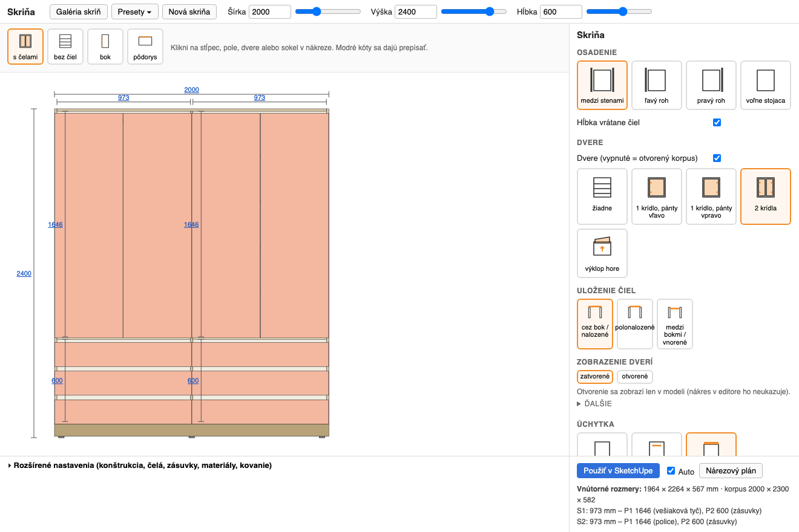

# Skrine — parametric wardrobes for SketchUp

A SketchUp 2026 extension that builds built-in and free-standing wardrobes from
parameters and turns them into a cut list. Instead of drawing panels by hand you
set width, height, depth, columns, shelves, drawers, doors and hardware in a
visual editor; the model is rebuilt after every change, and every part carries
its dimensions, material and edge banding as attributes, so the cut list comes
straight out of the model.

The editor is in Slovak; the code, the API and this documentation are in English.



## What it does

- **Parametric wardrobe** — outer size, wall/ceiling gaps, legs or plinth, cover
  and filler strips, per-panel carcass settings (thickness, corner joints,
  recesses), three back-panel modes.
- **Columns and cells** — any number of columns (fixed mm, ratio or auto width),
  each split into cells holding adjustable shelves, a hanging rail, drawers,
  inner drawers behind doors, or nothing. One click applies a ready-made column
  module ("hanging rail + 3 drawers", "5 shelves", …).
- **Doors** — none, single leaf (left/right), double, or a lift-up flap; overlay,
  half overlay or inset; reveals and gaps per side; hinge count from a table;
  doors can be drawn open.
- **Handles** — none (push-to-open), drilled (hole spacing and position) or an
  integrated profile that shortens the front.
- **Drawers** — front only, wooden box, or Blum LEGRABOX / TANDEMBOX / MERIVOBOX
  with editable catalogue tables; the runner's nominal length and the height
  class are picked automatically and reported when they do not fit.
- **3D view with a tape measure** — the same model in WebGL (three.js, bundled
  offline): orbit, section cut, doors drawn open, click to select, and a measure
  tool that snaps to part corners and can write a measured distance back into
  the matching parameter.
- **Cut list** — parts grouped by material, identical parts merged, edge banding
  in metres, hardware summary, area per material; exports to CSV, to a
  [CutList Optimizer](https://www.cutlistoptimizer.com/) CSV and to a printable
  HTML page.
- **Presets and gallery** — save a wardrobe as a preset and pick it later from a
  gallery of thumbnails, or start a new wardrobe from one.

## Requirements

- SketchUp 2026 (SketchUp 2017+ should work; only 2026 is tested) on macOS or
  Windows.
- Nothing else for using the extension. For development: Ruby 3.2+ (the test
  suite runs outside SketchUp) and Node (only for `node --check`).

## Install

```bash
git clone https://github.com/Solimatorko/sketchup-skrine.git
cd sketchup-skrine
scripts/install_dev.sh          # symlinks src/ into SketchUp's Plugins folder
```

Restart SketchUp. See [docs/installation.md](docs/installation.md) for the
Windows path, packaging and troubleshooting.

## Quick start

1. **Extensions › Skrine › Nová skriňa** (New wardrobe) — a wardrobe appears at
   the origin and the editor opens.
2. Set width, height and depth at the top; click a door, a shelf, a drawer or the
   plinth in the drawing to open its panel on the right.
3. Pick a column module, change the cell contents, or retype a blue dimension in
   the drawing.
4. With **Auto** on, the SketchUp model is rebuilt after every change; otherwise
   press **Použiť v SketchUpe** (Apply).
5. **Nárezový plán** (Cut list) opens the parts list with CSV/HTML export.

The full walkthrough is in [docs/user-guide.md](docs/user-guide.md).

## Try the editor without SketchUp

The editor is plain HTML/JS talking to a small Ruby service, so it runs in an
ordinary browser with the model computed by the same code the extension uses:

```bash
scripts/ui            # starts a local server and opens http://localhost:8792/
scripts/ui stop
```

Everything works except the three things that need SketchUp: rebuilding the
model, the file dialogs and the cut-list window.

## Documentation

| Document | Contents |
|---|---|
| [Installation](docs/installation.md) | Install, update, uninstall, troubleshooting |
| [User guide](docs/user-guide.md) | The editor screen by screen, presets, gallery |
| [Parameter reference](docs/parameters.md) | Every parameter, default, range and meaning (generated from the schema) |
| [Cut list](docs/cut-list.md) | How parts are grouped, the CSV formats, CutList Optimizer import |
| [Architecture](docs/architecture.md) | Layers, scene JSON, dialog bridge, attributes in the model |
| [Development](docs/development.md) | Tests, dev server, scripts, adding a new object type |

Design documents under `docs/superpowers/` are written in Slovak and record how
the plugin and its editor were designed.

## Status

The model layer, the cut list and the editor are covered by 128 tests and a
browser QA pass. Drawer system tables (LEGRABOX, TANDEMBOX, MERIVOBOX) ship with
typical catalogue values — check them against the current Blum catalogue before
ordering. A toolbar with icons and a 3D preview are not implemented yet.

## License

MIT — see [LICENSE](LICENSE).
